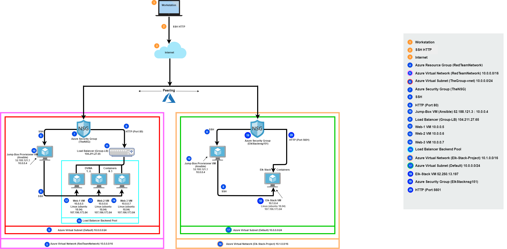

## Automated ELK Stack Deployment

The files in this repository were used to configure the network depicted below.

These files have been tested and used to generate a live ELK deployment on Azure. They can be used to either recreate the entire deployment pictured above. Alternatively, select portions of the elk.yml file may be used to install only certain pieces of it, such as Filebeat.

  -[Playbook File](

This document contains the following details:
- Description of the Topologu
- Access Policies
- ELK Configuration
  - Beats in Use
  - Machines Being Monitored
- How to Use the Ansible Build

### Description of the Topology

The main purpose of this network is to expose a load-balanced and monitored instance of DVWA, the D*mn Vulnerable Web Application.

Load balancing ensures that the application will be highly availabe, in addition to restricting overloaded servers to the network.
Load balancers play a very important role in security. The off-loading function of a load balancer defends an organization against distributed denial-of-service attacks and it does this by shifting attack traffic from the corporate server to a public cloud provider. The advantage of a jump box is that it is exposed to the public internet which means that it sits infront of all the other machines that are not exposed and it controls the access to the other machines by allowing connections from specific IP address and forwarding to those machines.

Integrating an ELK server allows users to easily monitor the vulnerable VMs for changes to the data and system logs.
Filebeat watches out for log information about the file system, including which file have changed and when.
Metricbeat periodically collects metrics from the operating system and from services running on the server. It then takes the metrics and statistics that it collects and ships them to an output that you specify.

The configuration details of each machine may be found below.
_Note: Use the [Markdown Table Generator](http://www.tablesgenerator.com/markdown_tables) to add/remove values from the table_.

|    Name   |  Function | IP Adress | Operating System     |
|:---------:|:---------:|-----------|----------------------|
| Jump-Box  |  Gateway  | 10.0.0.4  | Linux (ubuntu 18.04) |
| Elk-Stack | Container | 10.1.0.4  | Linux (ubuntu 18.04) |
| Web-1     | Container | 10.0.0.5  | Linux (ubuntu 18.04) |
| Web-2     | Container | 10.0.0.6  | Linux (ubuntu 18.04) |
| Web-3     | Container | 10.0.0.7  | Linux (ubuntu 18.04) |

### Access Policies

The machines on the internal network are not exposed to the public Internet. 

Only the Jump-Box-Provisioner machine can accept connections from the Internet. Access to this machine is only allowed from the following IP addresses:
107.196.173.84

Machines within the network can only be accessed by ssh(ing) in using ssh private key.
I was able to access my Elk-Stack VM through my Jump-Box-Provisioner VM: 52.188.121.3.

A summary of the access policies in place can be found in the table below.

|    Name   | Publicly Accessible | Allowed IP Addresses |
|:---------:|:-------------------:|----------------------|
| Jump-Box  |         Yes         |     52.188.121.3     |
| Elk-Stack |         Yes         |     52.250.13.197    |
| Web-1     |          No         |       10.0.0.5       |
| Web-2     |          No         |       10.0.0.6       |
| Web-3     |          No         |       10.0.0.7       |

### Elk Configuration

Ansible was used to automate configuration of the ELK machine. No configuration was performed manually, which is advantageous because...
It automates cloud provisioning, configuration management, application deployment, intra-service orchestration, etc. allowing for a user to not have to configure the virtual machine everytime they go in and access it.
The playbook implements the following tasks:
- _TODO: In 3-5 bullets, explain the steps of the ELK installation play. E.g., install Docker; download image; etc._
- ...
- ...

### Target Machines & Beats
This ELK server is configured to monitor the following machines:
10.0.0.5, 10.0.0.6, 10.0.07

We have installed the following Beats on these machines:
Filebeat and Metricbeat.

These Beats allow us to collect the following information from each machine:
Filebeat monitors the log files or locations you specify and can collect the log events, which we can use to forward and centralize log data. Metricbeat is used to periodically collect metrics from the operating system and from services running on the servers.

### Using the Playbook
In order to use the playbook, you will need to have an Ansible control node already configured. Assuming you have such a control node provisioned: 

SSH into the control node and follow the steps below:
- Copy the _____ file to _____.
- Update the _____ file to include...
- Run the playbook, and navigate to ____ to check that the installation worked as expected.

_TODO: Answer the following questions to fill in the blanks:_
- _Which file is the playbook? Where do you copy it?_
- _Which file do you update to make Ansible run the playbook on a specific machine? How do I specify which machine to install the ELK server on versus which to install Filebeat on?_
- _Which URL do you navigate to in order to check that the ELK server is running?

